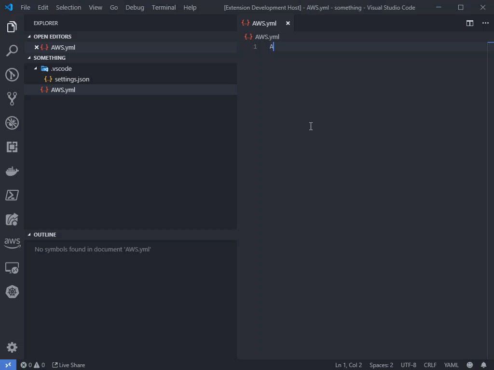
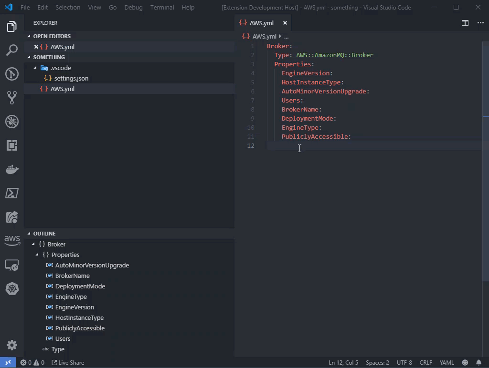

# cloudformation-ext-vscode

This extension is meant to make Cloudformation more accessible to new users. 
The extension takes the Cloudformation Resource Specification provided by AWS and generates completion items based on the Resource Type that you supply. 
Only provides resources marked as Required.

## Features
* Resource Autocompletion

* Property Autocompletion

